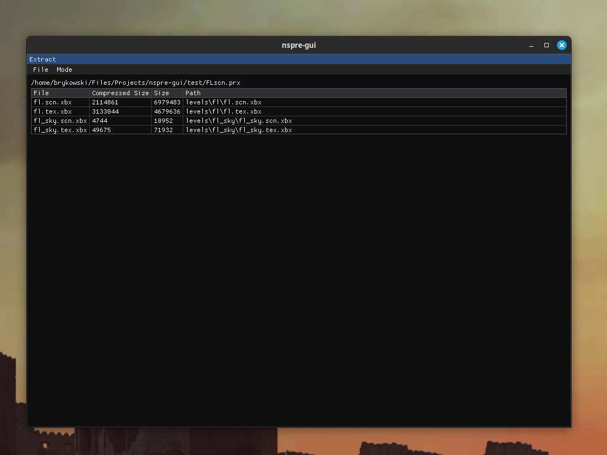
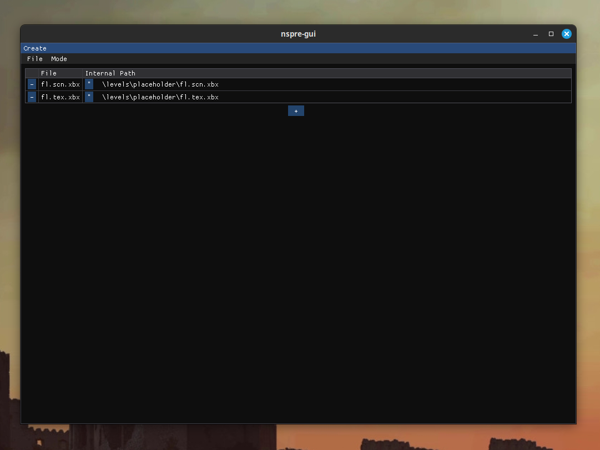
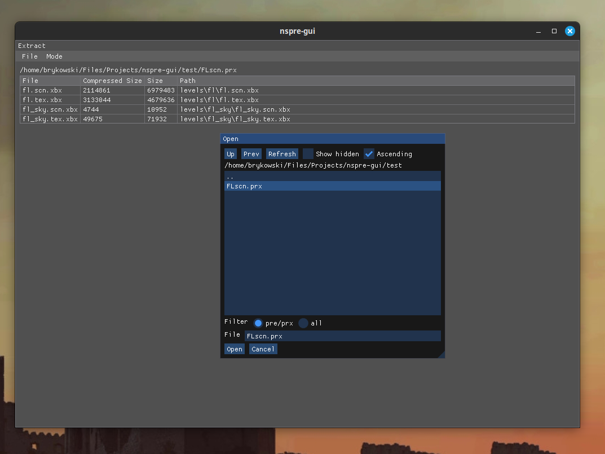
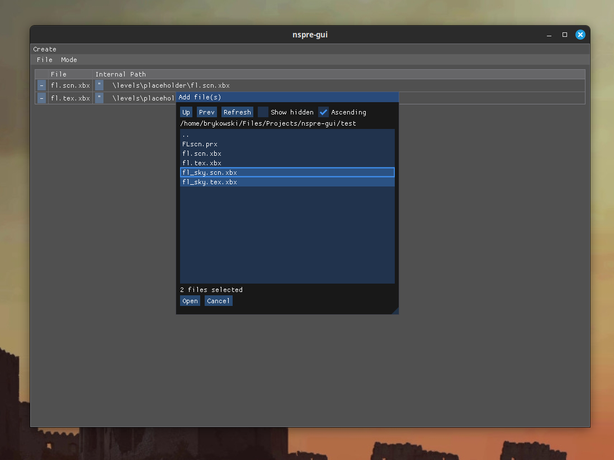

<p align="center">
	
	
	
	
</p>

# NSPRE-GUI

Create and extract Neversoft pre/prx files.

Built using [nspre](https://github.com/BryanRykowski/nspre) and [Dear ImGui](https://github.com/ocornut/imgui).

ⓒ 2025 Bryan Rykowski - [MIT License](./LICENSE)

## Building

### Prerequisites
- CMake
- SDL2 development files

### Instructions
Clone the repository.
```
git clone https://github.com/BryanRykowski/nspre-gui
```
Enter the directory and clone the submodules.
```
cd nspre-gui/
git submodule update --init --recursive
```
Create a build directory and generate the build files.
```
mkdir build
cmake -S . -B build/
```
Build the project.
```
cmake --build build/
```
Binary will be at `build/nspre-gui`